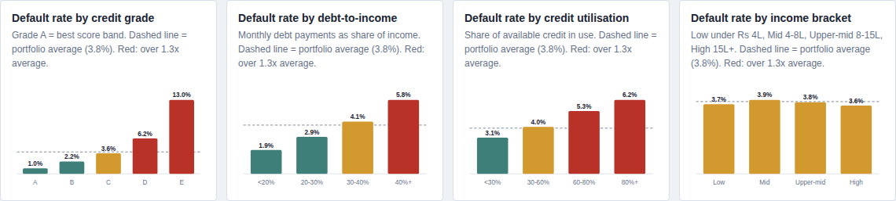
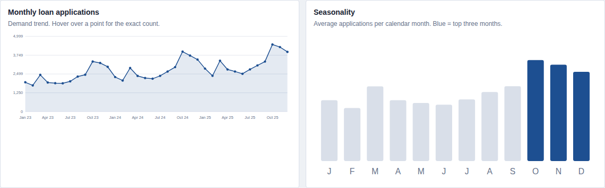

# Retail Credit Risk & Loan Demand Analytics

An end-to-end data analytics project analysing a simulated retail lending portfolio to identify credit-risk drivers, loan-demand patterns and operational bottlenecks.

### Dashboard
[Live Interactive Dashboard](https://ayushgupta-nsut.github.io/retail-credit-risk-analytics/)

### Tools
Python | SQL | Excel | HTML/JavaScript dashboard

> Note: The dataset is fully simulated for portfolio and analytical demonstration purposes. No real customer data is used.




## Project Flow
```
Business Problem
      |
Data Generation (Python)
      |
SQL Cleaning & Segmentation
      |
Python Analysis
      |
Excel Workbook + Interactive Dashboard
      |
Business Insights
      |
Recommendations
```

## Business Problem
A retail lender wants to know which borrowers drive defaults, when loan demand peaks, and where decision turnaround (SLA) is slipping, so it can tighten underwriting where needed and plan capacity ahead of peak months.

## Repository Structure
| Path | Contents |
|---|---|
| `index.html` | Interactive dashboard (Executive Overview, Risk Drivers, Demand & Operations, Recommendations) with year filter |
| `excel/Credit_Risk_Analysis.xlsx` | Dashboard tab with KPIs and charts, formula-driven analysis tab, 10,000-row sample |
| `sql/queries.sql` | Cleaning, deduplication, segmentation and analysis queries (SQLite) |
| `src/credit_risk_analysis.py` | Data simulation, SQL execution, Excel and dashboard build |
| `data/loans_clean.csv` | 99,884 cleaned loan applications |
| `docs/screenshots/` | Dashboard screenshots |

## Data Cleaning (SQL)
- Raw records: 100,500. Removed 500 duplicate loan IDs and 116 invalid credit scores. Final dataset: 99,884 records.
- Filled 3,288 missing or outlier incomes and 2,012 missing DTI values using regional averages.
- Created segments: credit grade (A-E), DTI band, credit utilisation band, income bracket and application month.

## Key Findings
Portfolio: 99,884 applications, 69.1% approved, 3.8% default rate, estimated credit loss of Rs 82 Cr.

- Credit grade is the strongest risk driver: Grade E defaults at 13.0% vs 1.0% for Grade A (13.3x).
- Debt-to-income matters: borrowers at DTI 40%+ default at 5.8% vs 1.9% below 20%.
- Credit utilisation above 80% is a warning sign: 6.2% default vs 3.1% under 30%.
- Highest-risk region is Central (4.5% default); lowest is South (3.5%).
- Demand peaks in Oct, Nov, Dec (festive/year-end season) and is lowest in Feb: plan staffing and credit-check capacity ahead of Q4.
- SLA breaches (decision > 5 days) fell from 31.2% in 2023 to 20.4% in 2025, but remain material.

## Recommendations
1. Tighten approval rules or pricing for Grade D/E applicants with DTI above 40% (see risk pockets).
2. Add a utilisation cap (>80%) as a secondary review trigger.
3. Increase processing staff before October; use monthly demand as a staffing forecast.

## Assumptions and Limitations
- Data is simulated; relationships between variables are built into the generator, so results demonstrate the method rather than real market behaviour.
- Loss given default is assumed at 60% of loan value. SLA breach is defined as a decision taking more than 5 days.
- Default is a binary flag; time-to-default and probability-of-default modelling are out of scope.

## Run Locally
```
pip install -r requirements.txt
python src/credit_risk_analysis.py
```
Open `index.html` in a browser to view the dashboard.
